[](https://mseep.ai/app/chirag127-clear-thought-mcp-server)

# Clear Thought MCP Server

> Systematic thinking, mental models, and debugging approaches — as MCP tools for any AI client.

[](LICENSE)
[](https://github.com/chirag127/Clear-Thought-MCP-server/stargazers)
[](https://github.com/chirag127/Clear-Thought-MCP-server/commits)
[](https://www.typescriptlang.org/)
[](https://nodejs.org/)
[](https://github.com/chirag127/Clear-Thought-MCP-server/actions/workflows/ci.yml)
[](https://smithery.ai/server/@chirag127/clear-thought-mcp-server)

## What it is / why it exists

An [MCP](https://modelcontextprotocol.io) server that gives an AI assistant a toolbox of **structured reasoning frameworks** — mental models, design patterns, systematic debugging, decision analysis, the scientific method, and more — so it reasons deliberately instead of improvising. Each mode is an explicit, inspectable tool the model calls, with typed (Zod-validated) inputs and a formatted, chain-of-thought-friendly response.

Twelve tools, one server, zero required configuration.

## Links

- **Live MCP endpoint:** <https://clear-thought-mcp-server.oriz.in> (Streamable HTTP, MCP 2.0)
- **GitHub Pages:** <https://chirag127.github.io/Clear-Thought-MCP-server/>
- **Smithery:** <https://smithery.ai/server/@chirag127/clear-thought-mcp-server>
- **Repo:** <https://github.com/chirag127/Clear-Thought-MCP-server>

⭐ If this is useful, please star the repo — it helps others find it.

## Architecture

```mermaid
flowchart LR
    Client["MCP Client<br/>(Claude, Cursor, opencode, ...)"]
    subgraph Server["clear-thought-mcp-server"]
        direction TB
        T1["sequentialthinking"]
        T2["mentalmodel"]
        T3["designpattern"]
        T4["programmingparadigm"]
        T5["debuggingapproach"]
        T6["collaborativereasoning"]
        T7["decisionframework"]
        T8["metacognitivemonitoring"]
        T9["scientificmethod"]
        T10["structuredargumentation"]
        T11["visualreasoning"]
        T12["stochasticthinking"]
    end
    Client -->|"Streamable HTTP (MCP 2.0) /mcp<br/>or stdio"| Server
    Server -->|"formatted reasoning result"| Client
```



## Tools

| Tool | What it does |
| --- | --- |
| `sequentialthinking` | Dynamic, reflective step-by-step problem solving with revisions & branches |
| `mentalmodel` | Apply a named model (first principles, Occam's razor, Pareto, opportunity cost, error propagation, rubber duck) |
| `designpattern` | Software architecture patterns (modular, API integration, state, async, scalability, security, agentic) |
| `programmingparadigm` | Reason through imperative / OO / functional / reactive / concurrent … paradigms |
| `debuggingapproach` | Systematic debugging (binary search, reverse engineering, divide & conquer, backtracking, cause elimination, program slicing) |
| `collaborativereasoning` | Simulate a panel of expert personas with diverse perspectives |
| `decisionframework` | Structured decision analysis and rational choice |
| `metacognitivemonitoring` | Self-monitor knowledge boundaries and reasoning quality |
| `scientificmethod` | Formal hypothesis → experiment → analysis loop |
| `structuredargumentation` | Dialectical reasoning — claims, rebuttals, synthesis |
| `visualreasoning` | Create/manipulate diagrams and visual representations |
| `stochasticthinking` | Probabilistic reasoning over uncertain problems |

## Features

- 12 reasoning tools, each with a typed Zod input schema and formatted output
- Two transports: **stdio** (local clients) and **Streamable HTTP** (MCP 2.0, remote)
- Zero required configuration — no keys, no state, no external calls
- Installable via `npx`, [Smithery](https://smithery.ai), or the hosted endpoint

## Tech stack

- **TypeScript** + **Node.js** (ESM, `>=18`)
- [`@modelcontextprotocol/sdk`](https://github.com/modelcontextprotocol/typescript-sdk) `^1.29`
- [`zod`](https://zod.dev) for input validation, `chalk` for formatting
- `vitest` for tests, `tsc` build

## Repo structure

```
Clear-Thought-MCP-server/
├── src/
│   ├── index.ts              # server bootstrap, tool registration, stdio + HTTP transports
│   ├── models/interfaces.ts  # shared TypeScript interfaces
│   └── tools/                # one module per reasoning tool (mentalModelServer.ts, ...)
├── dist/                     # compiled JS (tsc output)
├── test/                     # vitest suites
├── Dockerfile                # container image
├── smithery.yaml             # Smithery deploy config
└── package.json
```

## Quick start

### Run with npx (stdio)

```bash
npx clear-thought-mcp-server
```

### Install via Smithery

```bash
npx -y @smithery/cli install @chirag127/clear-thought-mcp-server --client claude
```

### MCP client config

Hosted (Streamable HTTP):

```json
{
  "mcpServers": {
    "clear-thought": {
      "url": "https://clear-thought-mcp-server.oriz.in/mcp"
    }
  }
}
```

Local (stdio via npx):

```json
{
  "mcpServers": {
    "clear-thought": {
      "command": "npx",
      "args": ["-y", "clear-thought-mcp-server"]
    }
  }
}
```

### Run the HTTP transport yourself

```bash
npm install
npm run build
HTTP_PORT=3779 npm start   # serves Streamable HTTP at http://localhost:3779/mcp
```

### Register it

- **MCP Registry:** <https://registry.modelcontextprotocol.io>
- **Smithery:** `@chirag127/clear-thought-mcp-server` — <https://smithery.ai/server/@chirag127/clear-thought-mcp-server>

## Configuration

No configuration is required. Optional environment variables:

| Variable | Purpose |
| --- | --- |
| `HTTP_PORT` | Port for the Streamable HTTP transport (default `3779`) |

## Part of the oriz family

One of ~80 sites and tools in the [oriz](https://blog.oriz.in) family. It reasons; the [Stochastic Thinking MCP Server](https://github.com/chirag127/Stochastic-Thinking-MCP-Server) handles probabilistic decision-making, and [knowledge-mcp](https://github.com/chirag127/knowledge-mcp) serves the knowledge base.

## Contributing

Issues and PRs welcome. Conventional commits are the changelog.

## License

MIT — see [LICENSE](LICENSE).

## Author

Chirag Singhal · <chirag@oriz.in> · [@chirag127](https://github.com/chirag127)

## Status

Stable (`v1.1.2`). Roadmap: more mental models, richer visual-reasoning output.
